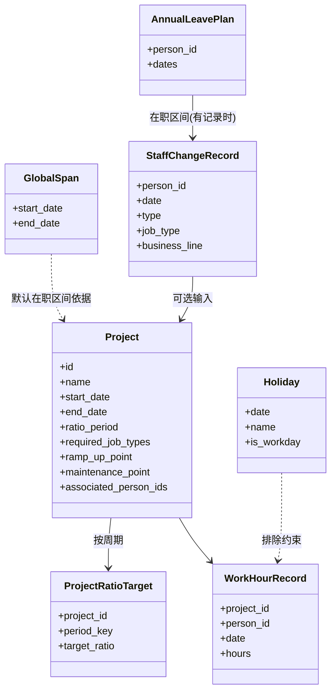

# 数据模型

> 核心实体：全局生成区间、项目（周期比例 + 生命周期）、员工（默认值兜底或按人事变更记录推导）、节假日、年假、每日工时记录。无打卡时间点，粒度为"每日工时"。会话内内存态，不持久化（ADR-0006 D1）。

## 核心实体

> 工种与业务线退化为字符串标签（ADR-0006 D2），不再是独立实体；会话内运行时字典收集已出现的字符串供复选。
> Person 不作为静态实体存储；员工属性由 StaffChangeRecord 推导或默认值兜底（ADR-0007）。

## 字段说明

| 实体 | 关键字段 | 说明 |
|---|---|---|
| GlobalSpan | start_date, end_date | 全局生成区间，会话必设；默认在职区间依据（ADR-0007 D2） |
| Project | ratio_period | 比例周期粒度：`year` \| `quarter` \| `month`（ADR-0003 D1） |
| Project | required_job_types | 该项目要求的工种字符串集合，每种至少 1 名人员 |
| Project | ramp_up_point, maintenance_point | 生命周期切换点，optional，默认 start/end（ADR-0004 D1/D2） |
| Project | associated_person_ids | 关联员工子集（须覆盖工种），⊆ 当日全员且在职 |
| ProjectRatioTarget | period_key, target_ratio | 每个周期一个目标比例 |
| StaffChangeRecord | type | `onboard` / `leave` / `transfer`，**可选输入**（ADR-0007 D1） |
| StaffChangeRecord | job_type | onboard 时确定，字符串标签；未提供则默认"研发人员"（ADR-0007 D3） |
| StaffChangeRecord | business_line | onboard/transfer 时生效，字符串标签；**可空**（ADR-0007 D4）；**预留字段，当前不实现消费**（ADR-0007 修订记录，业务线与项目关联影响排布倾向，未来软偏好） |
| Holiday | date, is_workday | 节假日与调休工作日；来源 `timor.tech` API（ADR-0002 D4） |
| AnnualLeavePlan | dates | 随机分散年假日期集合，落在在职区间且非节假日 |
| WorkHourRecord | project_id, person_id, date, hours | 输出基本单元：一员工一日期一项目的工时 |

## 全员与在职区间（ADR-0003 + ADR-0007）

- **带变更记录的员工**：当日全员 = 当日 onboard 已生效且无 leave 的人员；在职区间 = onboard 到 leave；业务线按 transfer 分段；工种 onboard 时固定。
- **未提供变更记录的员工（默认值兜底）**：
  - 在职区间 = 全局生成区间（GlobalSpan）。
  - 工种 = "研发人员"（默认）。
  - 业务线 = 空（不适用，不参与约束）。
- 混合支持：同一会话内部分员工带记录、部分用默认值。

## 项目生命周期（ADR-0004）

- 三切换点切四阶段：warmup（低权重）→ full（基准 1.0）→ maintenance（低权重）。
- 切换点 optional，默认全期 full + 自然偏向抖动。权重固化为常量（NFR-002）。
- 与周期比例正交：周期比例管每周期总量，生命周期管周期内每天 8h 在各项目间的分配占比（ADR-0008 D3）。

## 约束模型

- 硬约束（必须满足，否则生成失败或回退）：
  - 工作日（分配工时日）每人当日总工时 **= 8h**（满载，ADR-0008 D1）
  - 单员工单日可按 1h 粒度拆分给多项目，跨项目工时求和 **= 8h**（ADR-0008 D2、ADR-0010 D2）
  - 节假日无工时；调休工作日可分配
  - 年假日无工时；年假休满（安排天数 = 额度）
  - 每个项目至少 1 名每个 required_job_types 的人员参与
  - 关联员工 ⊆ 当日全员且在职（含默认值兜底员工）
  - 每个周期：`Σ项目分配工时 / 全员可用工时 ≈ target_ratio`（容差待定）
- 业务线不参与任何约束（ADR-0007 D4）；业务线为预留字段，当前不录入不消费，未来作为项目-员工排布软偏好启用（ADR-0007 修订记录）。
- 软目标（尽量满足，非约束）：员工轮转持续性、生命周期占比、年假分散、自然偏向抖动（ADR-0009 D1/D3，通过贪心策略规则体现）。

## 持久化形态（ADR-0006）

- 全部业务数据仅内存态，会话结束即弃，本地不落盘。
- 唯一例外：节假日 API 缓存可本地落盘（ADR-0006 D3）。
- 不留存生成种子（ADR-0002 D5）。
- 用户通过导出 CSV/Excel 离线保管结果，工具不承担归档。
