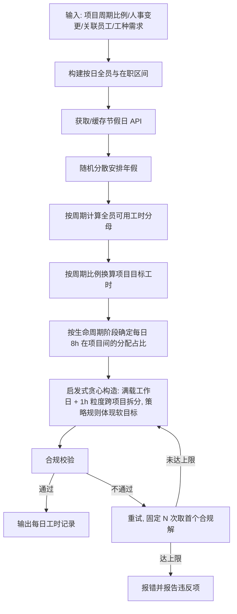

# 工时生成设计

> 回溯合规生成：约束满足 + 软目标优化（非纯填充，ADR-0009 D1）。构造一份满足周期投入比例与固化合规规则的每日工时记录，软目标通过贪心策略规则尽量实现。核心策略见 [ADR-0002](../decisions/0002-generator-strategy.md)，比例口径与人事变更见 [ADR-0003](../decisions/0003-ratio-denominator-and-staff-change.md)，生命周期分布见 [ADR-0004](../decisions/0004-project-lifecycle-profile.md)，满载与拆分见 [ADR-0008](../decisions/0008-daily-hours-full-and-split.md)，算法定位见 [ADR-0009](../decisions/0009-generator-algorithm.md)。

## 范式定位

| 维度 | 传统排班优化 | 本工具 |
|---|---|---|
| 目标 | 覆盖率/偏好最优 | 满足周期投入比例 + 过审 |
| 输入 | 需求班次 + 人员 | 周期比例 + 人事变更记录 + 关联员工 + 固化规则 |
| 输出 | 排班表 | 每日工时记录（CSV）+ 汇总（Excel） |
| 时态 | 未来排班 | 回溯/补齐历史记录 |
| 评价 | 目标函数值 | 合规校验通过 + 周期比例匹配 + 软目标尽量满足 |
| 优化 | 是 | 是（启发式贪心 + 随机化，非纯填充，ADR-0009 D1/D2） |
| 复现 | 通常支持 | 不要求（ADR-0002 D5） |

## 生成流程

## 核心策略（ADR-0002 + ADR-0003）

### 周期比例（ADR-0003 D1）

- 项目声明周期粒度 `year` | `quarter` | `month`，每周期一个 `target_ratio`。
- 分母 = 周期内全员（按人事变更记录动态构成）可用工时 = 全员有效工作日 × 8h。
- 分子 = 项目该周期实际分配工时。

### 项目生命周期分布（ADR-0004）

- 三切换点切四阶段：warmup（低权重）→ full（基准 1.0）→ maintenance（低权重）。
- 切换点 optional，默认全期 full + 自然偏向抖动。
- 与周期比例正交：周期比例管每周期总量，生命周期管每天 8h 在各项目间的分配占比（ADR-0008 D3）。
- 优先级：周期总量 > 生命周期占比 > 自然偏向；超限回退。
- 权重值固化为常量（NFR-002），warmup/maintenance 占比建议 0.2~0.6，待标定。

### 人事变更记录（ADR-0003 D2）

- `StaffChangeRecord` 三类：`onboard` / `leave` / `transfer`。
- 按日期构建全员构成、在职区间、业务线分段。
- 工种 onboard 时固定，不变更。
- 关联员工 ⊆ 当日全员且在职。

### 员工轮转 + 项目持续性（ADR-0002 D2 + ADR-0011）

- 员工按轮转分配，单项目内保持连续工作日块，不轻易逐日切换。
- 持续性按 ≥1h 判定：某天给该项目 ≥1h 即参与，0h 即断点（ADR-0011 D1）。
- 连续块最小 3 天，贪心优先构造 ≥3 天块，固化为常量（ADR-0011 D3）。
- 拆分组合每天独立但参考前一天避免过量抖动：以昨天为基准小幅偏移，渐变而非跳变（ADR-0011 D2）。
- 允许同一员工在多项目并行投入。
- 单员工单日跨项目工时求和 = 8h（满载，1h 粒度拆分给多项目，ADR-0008 D2、ADR-0010 D2）。

### 年假随机分散（ADR-0002 D3）

- 在职区间内、非节假日的日期中随机选取年假日。
- 倾向分散：打散到多个片段，避免连续大段。

### 节假日 API + 缓存（ADR-0002 D4）

- `http://timor.tech/api/holiday/year/xxxx` 按年度获取，本地缓存。
- 离线场景：仅可用已缓存年度；未缓存年度在离线时报错。
- 调休工作日按 API 的 `workday` 标记处理。

### 不复现（ADR-0002 D5）

- 不固定随机种子；同输入多次生成结果可不同。
- 测试时局部注入固定种子以构造确定性用例。

## 合规校验

生成后对结果程序化校验（NFR-001）：
- 工作日每人当日总工时 = 8h（满载，ADR-0008 D1）
- 单员工单日跨项目工时求和 = 8h（可拆分，ADR-0008 D2）
- 节假日集合内无记录；调休工作日可有记录
- 年假日集合内无记录
- 每位员工年假安排天数 = 额度
- 每个项目至少 1 名每个 required_job_types 的人员参与
- 关联员工 ⊆ 当日全员且在职
- 每个周期 `Σ项目分配工时 / 全员可用工时 ≈ target_ratio`（容差待定）

校验通过才输出；不通过触发固定 N 次重试（ADR-0009 D4），N 次都失败则报错并报告违反项（FR-007）。

## 求解策略（ADR-0009）

- 启发式贪心 + 随机化构造，无 CP-SAT/OR-Tools 重依赖。
- 软目标通过贪心策略规则体现（非全局评分函数）：员工轮转顺序、连续块优先、年假分散插入、生命周期阶段决定占比、随机抖动。
- 固定 N 次重试（N 待标定，建议 10），取首个通过合规校验的解。
- MVP 用贪心；后续里程碑可升级为贪心 + 局部搜索，不阻塞。

## 性能与可扩展性（ADR-0009 D5）

- 不设性能硬上限，生成完成即出，UI 显示进度（当前轮次/总轮次、当前阶段）。
- 按日全员构建为线性；周期分母计算按周期聚合；贪心构造单轮为多项式复杂度，固定 N 次重试有上界。
- 软目标质量强依赖贪心策略规则设计，实现期需标定连续块最小长度、抖动幅度、N 等参数。
