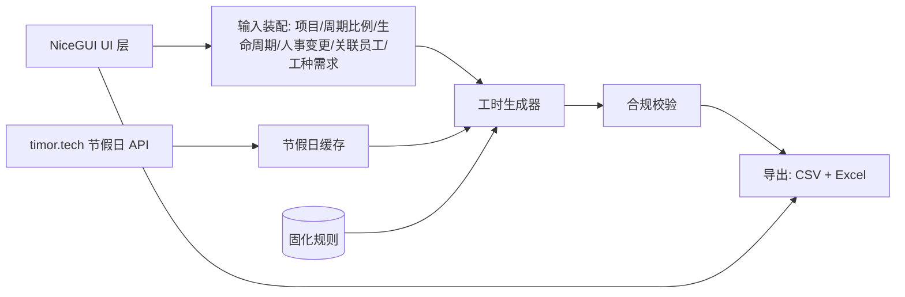

# 系统总览

> 回溯性合规生成器：输入"项目周期投入比例 + 生命周期时间点（可选）+ 人事变更记录 + 关联员工 + 固化合规规则"，输出"每日工时记录（CSV）+ 多粒度汇总（Excel）"。

## 技术栈

Python 3.14 + NiceGUI + uv + PyInstaller，正式确认见 [ADR-0013](../decisions/0013-runtime-model-and-tech-stack.md)，详见 [AGENTS.md](../../AGENTS.md)。生成异步执行不卡 UI（具体模型原型期定）；节假日缓存落盘到平台规范用户目录；支持多实例并行。

## 模块边界

## 核心数据流

输入 → 装配（工种覆盖、按日全员构建）→ 节假日获取/缓存 → 年假安排 → 周期分母计算 → 比例换算 → 生命周期按日权重 → 员工轮转加权填充 → 合规校验 → 导出。生成器是核心；合规校验做硬约束把关，不满足则回退重生成或报错。

## 进程与部署形态

native window 模式（推荐）或浏览器模式；单文件/目录二进制离线运行。节假日数据首次需联网获取并缓存，之后可离线生成（见 [ADR-0002 D4](../decisions/0002-generator-strategy.md)）。生成数据本地化，不上云。
