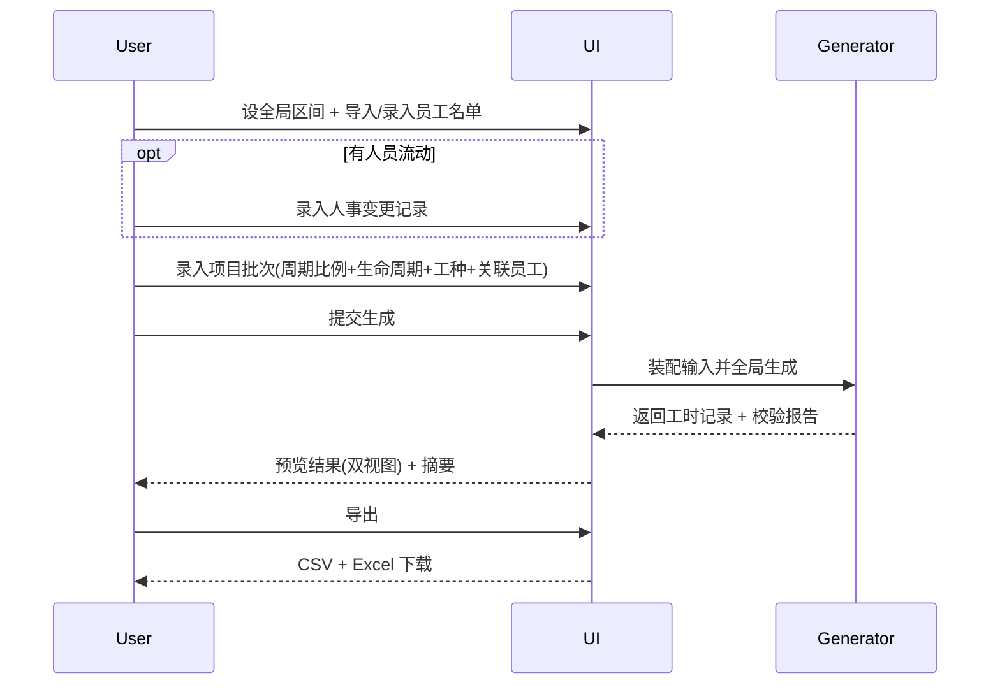

# UI 架构

> NiceGUI 页面结构、组件拆分、状态管理与事件流。会话模型为一次性，内存态，不留痕（ADR-0006）。

## 页面结构（最简路径优先）

第一屏引导最简场景，完整人事变更录入为可选增强：

1. **全局生成区间**：设定 start_date / end_date（会话必设，默认在职区间依据，ADR-0007 D2）。
2. **员工名单**：导入 CSV/Excel 或 UI 录入（仅姓名/标识；工种列可省默认"研发人员"；业务线可空）。会话内运行时字典即时收集工种/业务线字符串（ADR-0006 D2）。
3. **（可选）人事变更记录**：有人员流动时才录入（模式 A 全量导入 / 模式 B UI 时间线表格）；未录入的员工用默认值兜底。
4. **项目录入**：项目标识、起止日期、周期粒度、按周期 target_ratio、所需工种（字符串复选/新增）、关联员工、生命周期切换点（可选）。支持一个批次多项目。
5. **生成**：提交整批全局生成（ADR-0005 D1），展示进度/结果摘要（含比例达成度与校验报告）。
6. **预览与导出**：预览每日工时（按人/按日双视图），导出 CSV + Excel；可转参数调整重生成（UC-project-003）。

> 固化合规规则与生命周期权重值不提供 UI 配置入口（NFR-002）。
> 无字典管理独立首屏；工种/业务线在录入字段处即时新增。

## 组件拆分

- 全局区间选择器
- 员工名单导入/表格（含工种/业务线字段复选+新增二合一控件）
- 人事变更时间线表格（可选）
- 周期比例录入表（按粒度生成周期行）
- 生命周期切换点选择器（可选）
- 项目批次列表（增删项目）
- 工时预览双视图（按人/按日）
- 合规校验报告面板（违反项可跳转记录）

## 状态管理

- 全部输入态内存持有（不持久化，ADR-0006 D1）。
- 全局区间 + 员工名单 + 变更记录（可选）+ 项目批次。
- 生成结果：WorkHourRecord 列表 + 年假安排 + 校验报告；重生成覆盖旧结果（ADR-0006 D5）。
- 导出：触发后生成文件下载，工具不留副本。

## 事件流

